# l6-ifcs-sum2

This is a repo for the second summative assignment for the intensive foundations of computer science module in the L6 data science apprenticeship.

## Table of Contents

- [Introduction](#introduction)
- [Design Section](#design-section)
    - [GUI Design](#gui-design)
    - [Functional Requirements](#functional-requirements)
    - [Non-Functional Requirements](#non-functional-requirements)
    - [Tech Stack Outline](#tech-stack-outline)
    - [Code Design Document](#code-design-document)
- [Development Section](#development-section)
    - [Performance Considerations](#performance-considerations)
    - [Main Application Flow](#main-application-flow)
    - [Exception Handling](#exception-handling)
    - [Core Classes and Logic](#core-classes-and-logic)
    - [Code Documentation and Docstrings](#code-documentation-and-docstrings)
    - [Utility Modules](#utility-modules)
    - [Data Storage](#data-storage)
- [Testing Section](#testing-section)
- [Documentation Section](#documentation-section)
    - [User Documentation](#user-documentation)
    - [Technical Documentation](#technical-documentation)
- [Evaluation Section](#evaluation-section)

## Introduction

This project was developed within the context of the Department for Education (DfE), specifically reflecting the work of the Statistics Services Unit (SSU) operating alongside the Head of Profession for Statistics (HoP) office within the [Government Statistical Service (GSS)](https://analysisfunction.civilservice.gov.uk/government-statistical-service-and-statistician-group/). This environment involves the production, analysis, and dissemination of official education statistics, with close alignment to professional standards set by the GSS. Staff are expected to apply the UK Code of Practice for Statistics when producing and communicating data to ensure outputs are trustworthy, high quality, and serve the public good.

The quiz application is relevant to the DfE as understanding the Code of Practice is essential for analysts and statisticians working under the leadership of the HoP. Within the Statistics Services Unit, the Code underpins decisions about data quality, transparency, and communication. The quiz supports employer needs by providing an accessible learning resource that can be used for staff development, onboarding, and continuing professional development activities, helping reinforce professional standards in a practical way.

The project was delivered as a Minimum Viable Product (MVP) in order to focus on essential functionality while remaining achievable within time and resource constraints. The MVP includes core features such as multiple choice questions, user input, and feedback, ensuring the application delivers learning value without unnecessary complexity. This reflects common practice in public sector digital and analytical projects, where iterative development is encouraged.

The application has been developed using Streamlit in Python. The repository includes the source code, documentation, and instructions for running the application locally.


## Design Section

### GUI Design
- The application uses Streamlit to provide a web-based graphical user interface (GUI).
- The application prototype was made on Figma. Use this link to see the [Figma prototype](https://www.figma.com/design/Emu6EbjRNC1RxjaPPBbMlO/ifc-sum2?node-id=4330-1381&t=ZigtyyaSCmRnOK08-1).
- If the link above does not work, please see the screenshots below for the prototype.

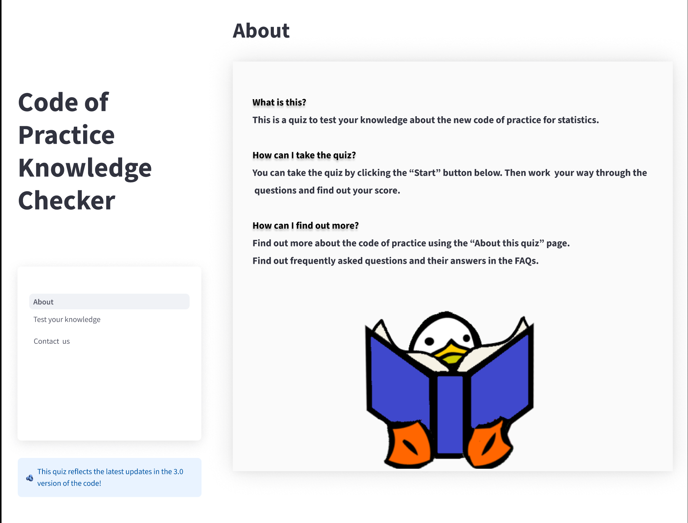
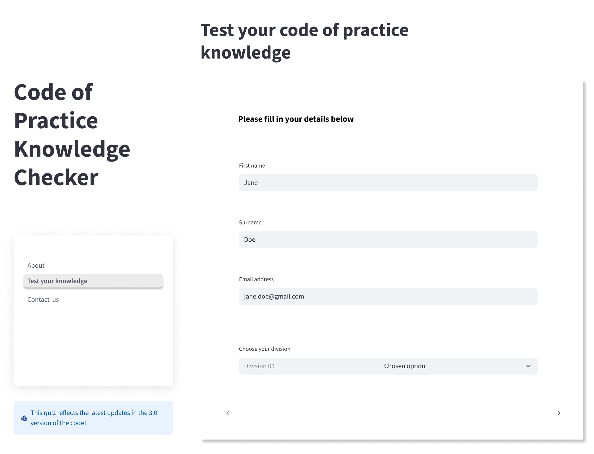
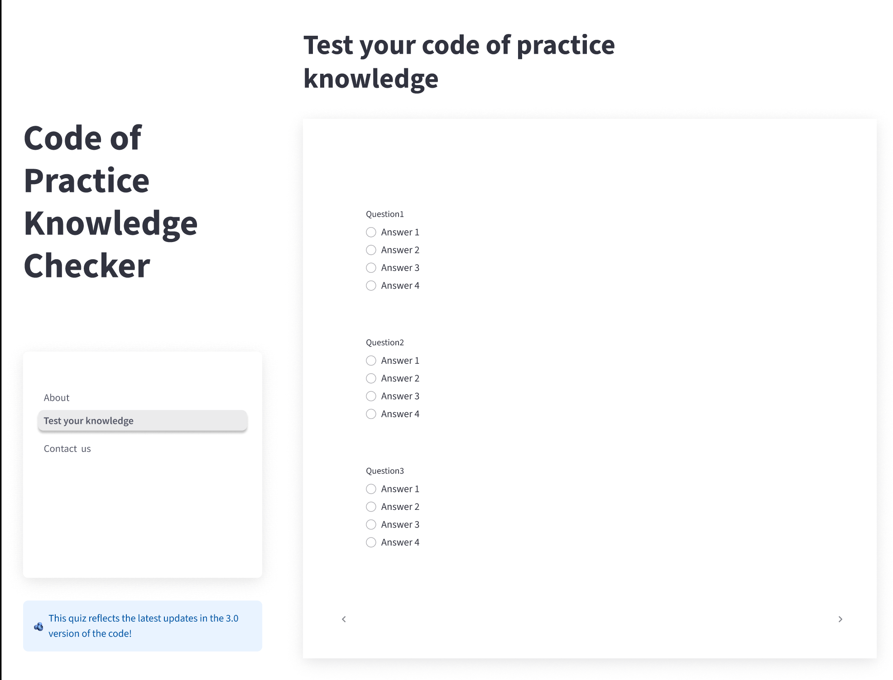
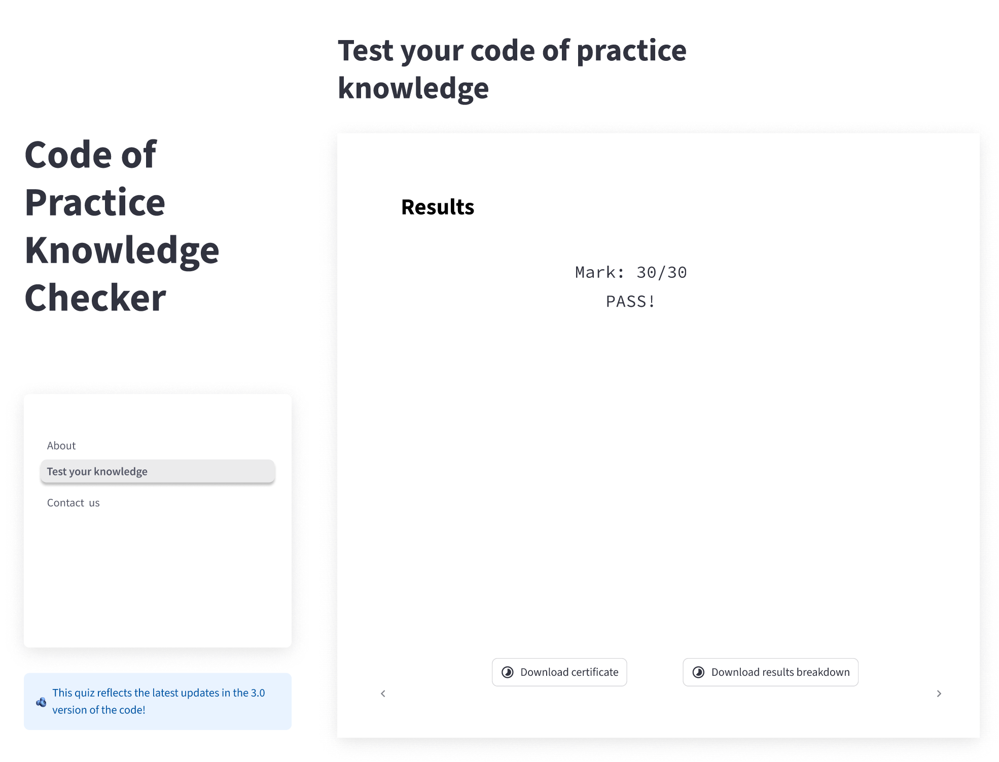
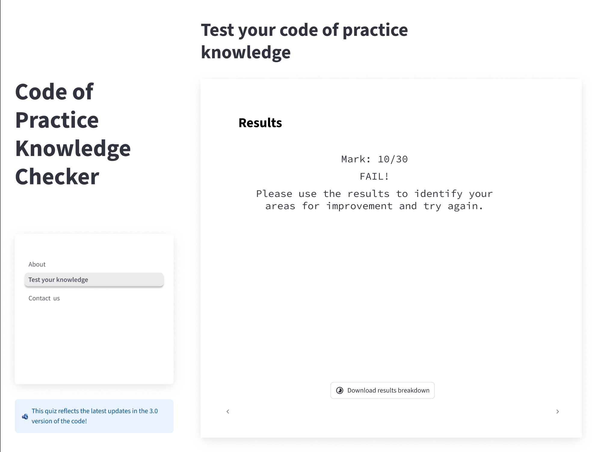
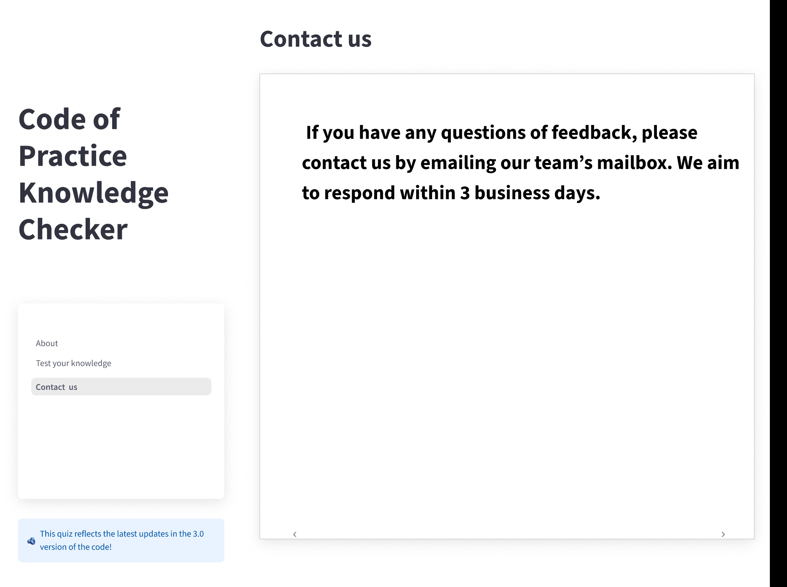

- The user journey is as follows:
    1. The user lands on the Info page, which provides a user guide, information about the Code of Practice, and FAQs.
    2. The user accesses the "Test your knowledge" page to start the quiz.
  3. A form collects the user's first name, last name, and email, with validation for each field.
  4. The quiz presents one question at a time, with multiple-choice answers using radio buttons.
  5. Immediate feedback is given after each answer (success or error message).
  6. At the end, the user sees their score and can export their answers as a CSV file or restart the quiz.
- Screenshots showing the user journey is shown below.
- The design is simple and accessible, suitable for non-technical users.
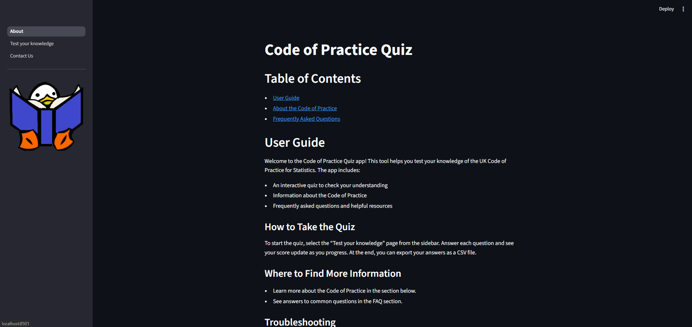
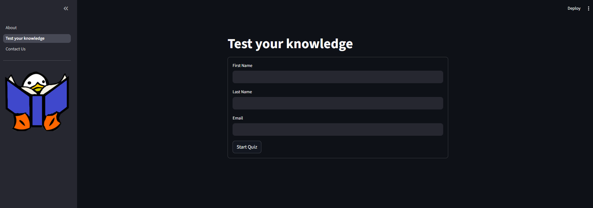
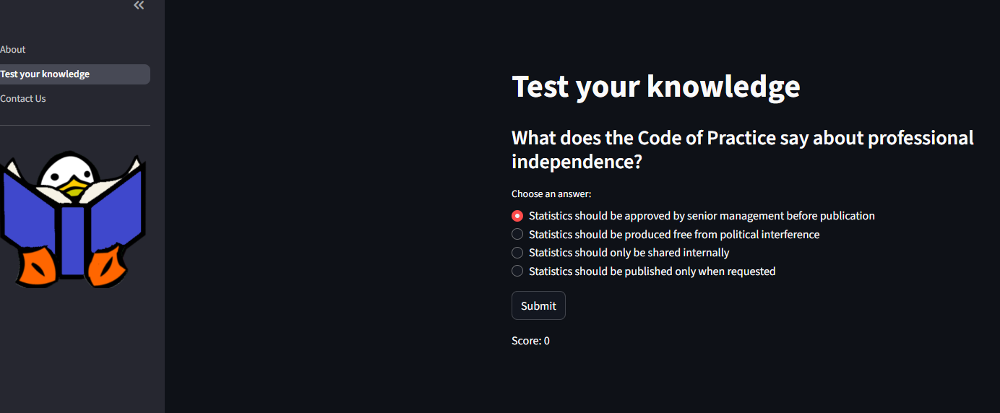
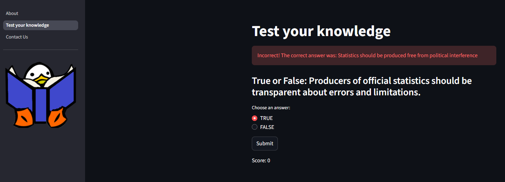
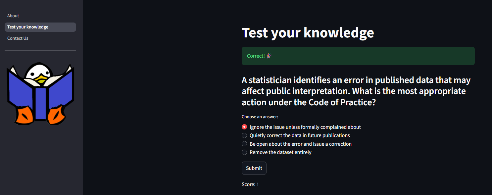
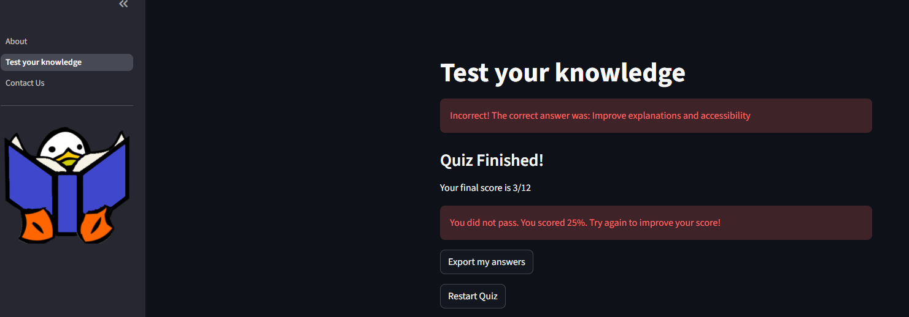
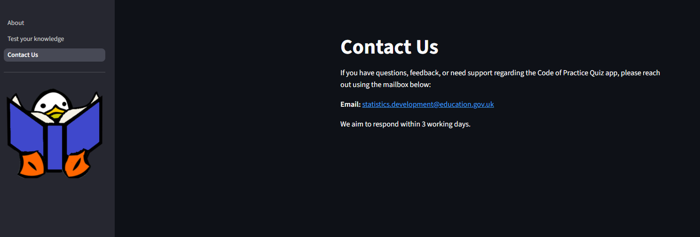


### Functional Requirements
- The system shall allow users to start a quiz via the GUI.
- The system shall validate user answers and provide immediate feedback.
- The system shall store quiz results in a CSV file.
- The system shall allow administrators to export results.

### Non-Functional Requirements

- The application shall be usable by non-technical staff.
- The system shall respond to user actions within 2 seconds.
- The codebase shall follow PEP 8 conventions.
- The application shall handle invalid input gracefully.
- The app should be accessible and usable on standard web browsers.
- All user data is stored locally in CSV files; no external database is required.
- The app should handle errors gracefully and provide clear feedback to users.

### Tech Stack Outline
- **Languages:** Python 3
- **Framework:** Streamlit (for GUI)
- **Libraries:**
  - pandas (for CSV/question handling)
  - streamlit (for UI and session state)
  - csv, io, re (standard library for file and input handling)
- **Environment**:
  - The following were components of the environment this application was developed and tested on:
    - Python Version Used: 3.13.7  
    - OS: Windows 11
- **Tools:**
  - Figma for prototyping
  - pytest (for testing)
- **Storage:**
  - Quiz questions: CSV file (`data/quiz_questions.csv`)
  - User scores: CSV file (`user_scores.csv`)

### Code Design Document
- The code is organized into modules for logic, forms, feedback, export, and session management.
- **Key Classes:**
  - `Question`: Represents a quiz question, possible answers, correct answer, and aspect/category.
  - `User`: Represents a quiz participant, tracks name, email, score, and answers.
  - `Quiz`: Manages the list of questions, current state, and answer logic.
- **Main Flow:**
  - The app initializes session state and loads questions from CSV.
  - User details are collected and validated.
  - The quiz logic presents questions, records answers, and updates scores.
  - Results are saved and can be exported.
- **Class Diagram (textual):**

```
User
 ├─ first_name: str
 ├─ last_name: str
 ├─ email: str
 ├─ score: int
 └─ answers: list
      └─ {question: Question, answer: str, correct: bool}

Question
 ├─ text: str
 ├─ possible_answers: list
 ├─ correct_answer: str
 └─ aspect: str

Quiz
 ├─ questions: list[Question]
 ├─ current_index: int
 ├─ from_csv(csv_path): Quiz
 ├─ current_question(): Question
 └─ answer_current(answer): (bool, Question)
```

- **Modules:**
    - `app/pages/`: Streamlit page scripts (Info, Test your knowledge, Contact Us)
  - `app/utils/`: Logic for quiz, forms, feedback, export, and session state
  - `data/`: Quiz questions CSV
  - `tests/`: Unit tests for logic and utilities

## Development Section


### Performance Considerations

A challenge during development was decreasing the load time for the quiz page, which was initially caused by loading the quiz data from CSV on every rerun. To address this, the code was structured to load the quiz questions once at the start of the session and store them in Streamlit's session state. This ensures that data is only loaded from disk a single time per user session, significantly improving responsiveness and user experience.


### Exception Handling

Exception handling is implemented throughout the application to ensure robust and user-friendly error management:

- **Quiz Loading:** When loading quiz questions from the CSV file, errors such as missing files or malformed data are caught. If an error occurs, a clear message is displayed to the user in the Streamlit interface, and the quiz will not proceed with invalid data.
- **Answer Processing:** When processing answers, the app checks for unexpected states (such as missing questions) and reports errors to the user if they occur, preventing crashes.
- **Exporting and Saving:** When exporting results or saving user scores, file I/O errors are caught and reported using Streamlit's error messaging, so users are informed if their data could not be saved or exported.
- **Input Validation:** All user input (names, emails) is validated before processing. Invalid input is rejected with a clear message, and the user is prompted to correct it.
- **General Feedback:** Any unexpected errors encountered during quiz progression or feedback are caught and displayed to the user, ensuring the app fails gracefully and provides actionable information.

#### Example: Exception Handling in Quiz Loading

Below is a code snippet from the `Quiz` class showing how exceptions are handled when loading quiz questions from a CSV file:

```python
@classmethod
def from_csv(cls, csv_path):
    """
    Create a Quiz instance from a CSV file of questions.
    Args:
        csv_path (str): Path to the CSV file.
    Returns:
        Quiz: An instance of the Quiz class.
    """
    try:
        df = pd.read_csv(csv_path)
        questions = []
        for q_text in df["question"].unique():
            q_df = df[df["question"] == q_text]
            possible_answers = list(q_df["possible_answers"])
            correct_answer = q_df[q_df["answer_indicator"] == "c"]["possible_answers"].iloc[0]
            aspect = q_df["aspect"].iloc[0]
            questions.append(Question(q_text, possible_answers, correct_answer, aspect))
        return cls(questions)
    except Exception as e:
        raise RuntimeError(f"Failed to load quiz CSV: {e}")
```

If an error occurs (such as a missing file or malformed data), a `RuntimeError` is raised with a descriptive message, ensuring the issue can be reported to the user and debugged effectively.

This script manages the user journey: collecting user details, presenting questions, handling answers, providing feedback, and exporting results.

### Main Application Flow

The application is structured as a Streamlit app with multiple pages:
- `About.py`: User guide, Code of Practice information, FAQs
- `Test your knowledge.py`: Main quiz logic
- `Contact Us.py`: Contact details and feedback form
The main quiz logic is in `app/pages/Test your knowledge.py`:

```
import streamlit as st
from utils.export_utils import *
from utils.session_utils import *
from utils.feedback_utils import *
from utils.form_utils import *
from utils.quiz_logic import Quiz, User

init_session(quiz = Quiz.from_csv("data/quiz_questions.csv"))

st.title("Test your knowledge")

# Display feedback if present
if st.session_state.feedback is not None:
    msg_type, msg_content = st.session_state.feedback
    if msg_type == "success":
        st.success(msg_content)
    else:
        st.error(msg_content)
    st.session_state.feedback = None

        msg_type, msg_content = give_feedback(st.session_state.quiz, st.session_state.user, answer)
```
import streamlit as st
import csv
from utils.export_utils import *
from utils.session_utils import *
from utils.feedback_utils import *
from utils.form_utils import *
import pandas as pd
from utils.quiz_logic import Quiz, User

# Initialize session state variables and load quiz questions from CSV
init_session(quiz = Quiz.from_csv("data/quiz_questions.csv"))

    Create a Quiz instance from a CSV file of questions.

# Show branding image in sidebar
st.sidebar.image("images/duck_guidance.png")

# Display feedback message if present in session state
if st.session_state.feedback is not None:
    msg_type, msg_content = st.session_state.feedback
    # Show success or error message based on feedback type
    if msg_type == "success":
        st.success(msg_content)
    else:
        st.error(msg_content)
    # Clear feedback after displaying so it doesn't persist
    st.session_state.feedback = None

# If user details are not yet provided, show the user form
if st.session_state.user is None:
    user_form()

# If quiz is ongoing, display the current question and answer options
elif st.session_state.quiz.current_question() is not None:
    q = st.session_state.quiz.current_question()
    st.subheader(q.text)
    # Show possible answers as radio buttons
    answer = st.radio("Choose an answer:", q.possible_answers)
    if st.button("Submit"):
        # Evaluate answer and update feedback in session state
        msg_type, msg_content = give_feedback(st.session_state.quiz, st.session_state.user, answer)
        st.session_state.feedback = (msg_type, msg_content)
        # Rerun to update UI and move to next question
        st.rerun()
    # Show current score after each question
    st.write(f"Score: {st.session_state.user.score}")

# If quiz is finished, display results and export options
else:
    st.subheader("Quiz Finished!")
    total = len(st.session_state.quiz.questions)
    score = st.session_state.user.score
    percent = (score / total) * 100 if total > 0 else 0
    st.write(f"Your final score is {score}/{total}")
    # Show pass/fail message based on score percentage
    if percent >= 80:
        st.success(f"Congratulations! You passed the quiz with {percent:.0f}% correct.")
    else:
        st.error(f"You did not pass. You scored {percent:.0f}%. Try again to improve your score!")
    # Save user score to CSV only once
    if not st.session_state.score_saved:
        write_user_scores(st.session_state.user, "user_scores.csv")
    st.session_state.score_saved = True
    # Prepare CSV data for download
    csv_data = export_results(st.session_state.user)
    st.download_button(
        label = "Export my answers",
        data = csv_data,
        file_name = "COP_quiz_answers.csv",
        mime = "text/csv"
    )
    # Allow user to restart the quiz by clearing session state
    if st.button("Restart Quiz"):
        del st.session_state.quiz
        del st.session_state.user
        st.rerun()
```
    Args:
        csv_path (str): Path to the CSV file.
    Returns:
        Quiz: An instance of the Quiz class.
    """
    try:
        df = pd.read_csv(csv_path)
        questions = []
        for q_text in df["question"].unique():
            q_df = df[df["question"] == q_text]
            possible_answers = list(q_df["possible_answers"])
            correct_answer = q_df[q_df["answer_indicator"] == "c"]["possible_answers"].iloc[0]
            aspect = q_df["aspect"].iloc[0]
            questions.append(Question(q_text, possible_answers, correct_answer, aspect))
        return cls(questions)
    except Exception as e:
        raise RuntimeError(f"Failed to load quiz CSV: {e}")
```

If an error occurs (such as a missing file or malformed data), a `RuntimeError` is raised with a descriptive message, ensuring the issue can be reported to the user and debugged effectively.

This script manages the user journey: collecting user details, presenting questions, handling answers, providing feedback, and exporting results.

### Core Classes and Logic

#### `Question` Class
Defines a quiz question, possible answers, the correct answer, and its aspect/category.


```
class Question:
    """
    Represents a quiz question with possible answers and the correct answer.
    Attributes:
        text (str): The question text.
        possible_answers (list): List of possible answers.
        correct_answer (str): The correct answer.
        aspect (str): The aspect/category of the question.
    """
    def __init__(self, text, possible_answers, correct_answer, aspect):
        # Question text
        self.text = text
        # List of possible answers
        self.possible_answers = possible_answers
        # The correct answer
        self.correct_answer = correct_answer
        # Category/aspect of the question
        self.aspect = aspect

    def is_correct(self, answer):
        # Compare provided answer to correct answer
        return answer == self.correct_answer
```

#### `User` Class
Tracks user details, score, and answers.


```
class User:
    """
    Represents a user taking the quiz, tracking their details and answers.
    Attributes:
        first_name (str): User's first name.
        last_name (str): User's last name.
        email (str): User's email address.
        score (int): User's current score.
        answers (list): List of answer records.
    """
    def __init__(self, first_name, last_name, email):
        # User's first name
        self.first_name = first_name
        # User's last name
        self.last_name = last_name
        # User's email address
        self.email = email
        # User's quiz score
        self.score = 0
        # List of user's answers
        self.answers = []

    def record_answer(self, question, answer, correct):
        # Store answer record (question object, answer, correctness)
        self.answers.append({"question": question, "answer": answer, "correct": correct})
        # Increment score if answer was correct
        if correct:
            self.score += 1
```

#### `Quiz` Class
Manages the list of questions, current state, and answer logic.


```
class Quiz:
    """
    Manages the quiz, including questions, current state, and answer logic.
    """
    def __init__(self, questions):
        # List of Question objects
        self.questions = questions
        # Index of current question
        self.current_index = 0

    @classmethod
    def from_csv(cls, csv_path):
        # Loads questions from a CSV file (see code for details)
        ...

    def current_question(self):
        # Return current question if quiz not finished
        if self.current_index < len(self.questions):
            return self.questions[self.current_index]
        else:
            return None

    def answer_current(self, answer):
        # Check if answer is correct
        question = self.current_question()
        correct = question.is_correct(answer)
        # Move to next question
        self.current_index += 1
        return correct, question
```


### Code Documentation and Docstrings

Docstrings are used throughout the codebase to document the purpose, parameters, and return values of classes and functions. This helps both users and developers understand how to use and maintain the code.

#### Example: Docstring for a Class Method

Below is an example of a docstring from the `Question` class:

```python
class Question:
    """
    Represents a quiz question with possible answers and the correct answer.
    Attributes:
        text (str): The question text.
        possible_answers (list): List of possible answers.
        correct_answer (str): The correct answer.
        aspect (str): The aspect/category of the question.
    """
    def __init__(self, text, possible_answers, correct_answer, aspect):
        """
        Initialize a Question instance.
        Args:
            text (str): The question text.
            possible_answers (list): List of possible answers.
            correct_answer (str): The correct answer.
            aspect (str): The aspect/category of the question.
        """
        self.text = text
        self.possible_answers = possible_answers
        self.correct_answer = correct_answer
        self.aspect = aspect
```

**How to Use Docstrings:**
- Docstrings appear as the first statement in a class, method, or function.
- They are used by documentation tools and IDEs to provide context and help.
- You can view docstrings in Python using the built-in `help()` function, e.g., `help(Question)`.
- Well-written docstrings make the codebase easier to understand, maintain, and extend.

### Utility Modules

- `form_utils.py`: Handles user input forms and validation (e.g., name and email checks).
- `feedback_utils.py`: Provides feedback after each answer.
- `export_utils.py`: Handles saving user scores and exporting answers to CSV.
- `session_utils.py`: Manages Streamlit session state variables.

#### Example: User Form Validation

```
def validate_name(name):
    # Name must be at least 2 characters
    if len(name) <= 1:
        return False
    # Name must be alphanumeric (no special chars)
    if not name.isalnum():
        return False
    return True

def validate_email(email):
    # Regex for basic email validation
    regex = r"[A-Za-z0-9._%+-]+@[A-Za-z0-9.-]+\.[A-Za-z]{2,7}"
    if re.fullmatch(regex, email):
        return True
    return False
```

### Data Storage
- Quiz questions are stored in `data/quiz_questions.csv`.
- User scores are appended to `user_scores.csv`.

### Testing
- The `tests/` directory contains unit tests for core logic, e.g., `test_quiz_logic.py` and `test_export_utils.py`.

This modular structure ensures the application is maintainable, testable, and easy to extend.

## Testing Section

### 1. Testing Strategy and Methodology

A systematic approach was taken to ensure the reliability and correctness of the application. The following methods were used:

- **Automated Unit Testing:**
  - Core logic modules (such as quiz logic, export utilities, and session management) are covered by automated unit tests using `pytest`.
  - Tests are located in the `tests/` directory and are run automatically in CI (Continuous Integration) using GitHub Actions.
  - Screenshots below show examples of tests passing locally and on GitHub through CI and GitHub Actions.
  - Automated tests ensure that individual functions and classes behave as expected and help prevent regressions.

  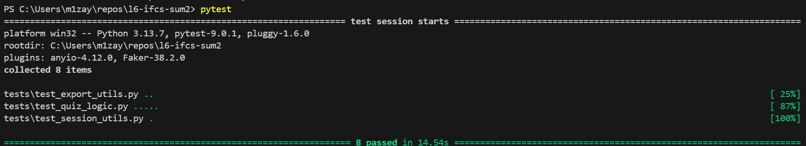
  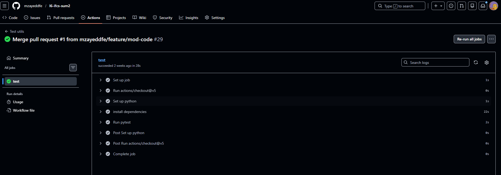

- **Manual Testing:**
  - The application was manually tested through the Streamlit GUI to verify the user journey, input validation, feedback, and data export features.
  - Manual tests focused on usability, error handling, and the overall user experience.

This combination of automated and manual testing provides both code-level assurance and real-world validation.

### 2. Outcomes of Application Testing

#### 2.1. Manual Test Outcomes

| Test Case Description                                 | Steps Taken                                      | Expected Result                | Actual Result   | Pass/Fail |
|------------------------------------------------------|--------------------------------------------------|-------------------------------|-----------------|-----------|
| Start quiz and submit valid user details              | Enter valid name and email, start quiz            | Quiz starts                    | Quiz starts     | Pass      |
| Submit invalid email                                 | Enter invalid email, submit form                  | Warning shown, cannot proceed  | Warning shown   | Pass      |
| Answer quiz questions                                | Select answers, submit each                      | Feedback after each answer     | Feedback shown  | Pass      |
| Complete quiz and export answers                     | Finish quiz, click export                        | CSV download prompt appears    | Prompt appears  | Pass      |
| Restart quiz                                         | Click restart after finishing                    | Quiz restarts, form resets     | Works as expected| Pass      |
| Submit empty form                                    | Leave fields blank, submit                       | Warning shown                  | Warning shown   | Pass      |
| Handle invalid input gracefully                      | Enter special characters in name/email            | Warning shown                  | Warning shown   | Pass      |

Screenshots below show examples of some of the manual testing carried out in the table above.

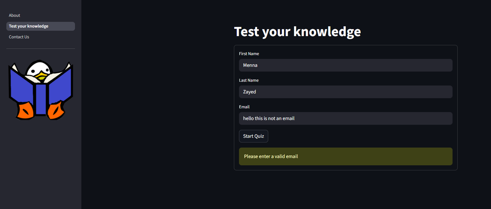
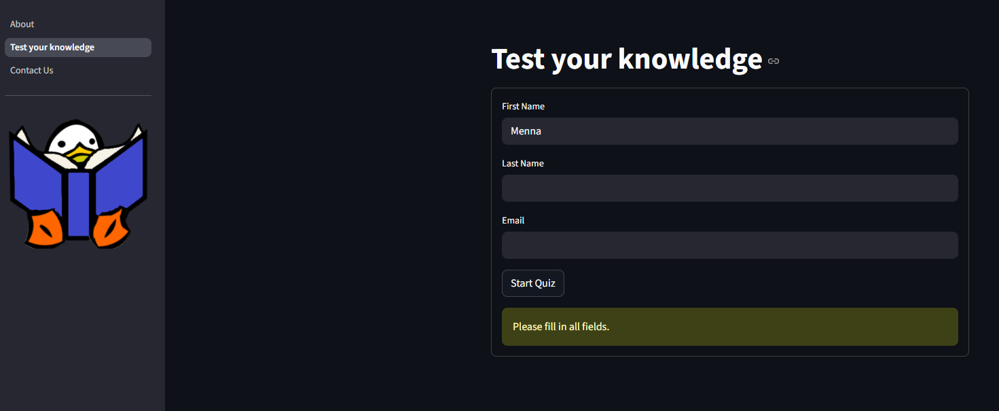
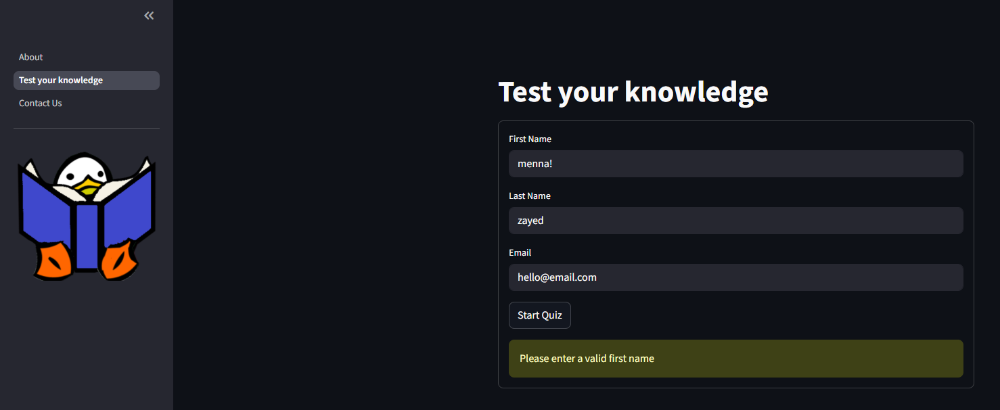

#### 2.2. Unit Testing Outcome

Automated unit tests were run using `pytest`. Below is an example screenshot of the tests running and passing:


- All core logic tests (quiz logic, export, session utils) passed successfully.
- Tests are re-run automatically on every code push via GitHub Actions CI.

If any test fails, details are shown in the CI logs and locally in the terminal, allowing for quick identification and resolution of issues.

## Documentation Section

### User Documentation

#### How to Use the Quiz Application
1. **Access the Application:**
   - Open the application in your web browser (typically via a provided Streamlit link or by running locally).
2. **Info Page:**
    - Read the user guide, information about the Code of Practice, and FAQs for an overview of the quiz and navigation instructions.
3. **Start the Quiz:**
   - Go to the "Test your knowledge" page.
   - Enter your first name, last name, and email address in the form. All fields are required and validated.
   - Click "Start Quiz" to begin.
4. **Answer Questions:**
   - For each question, select your answer and click "Submit".
   - Immediate feedback will be shown after each answer.
   - Your current score is displayed throughout the quiz.
5. **Finish and Export:**
   - At the end, your final score is shown.
   - You can download your answers as a CSV file for your records.
   - Click "Restart Quiz" to retake the quiz if desired.

#### Troubleshooting
- If you see a warning or error, check that all form fields are filled in correctly.
- If the application does not load, ensure you have a stable internet connection or contact your IT support.

### Technical Documentation

#### Running the Application Locally
1. **Clone the Repository:**
   ```sh
   git clone <repository-url>
   cd l6-ifcs-sum2
   ```
2. **Install Dependencies:**
   ```sh
   pip install -r requirements.txt
   ```
3. **Start the Application:**
   ```sh
    streamlit run app/pages/About.py
    # Or run any page directly, e.g.:
    streamlit run app/pages/Contact Us.py
   ```
   - Use the Streamlit sidebar to navigate between pages.

#### Running Tests Locally
1. **Install Test Dependencies:**
   - Ensure `pytest` is installed (included in requirements or install via `pip install pytest`).
2. **Run All Tests:**
   ```sh
   pytest
   ```
   - Test files are located in the `tests/` directory.
   - Test results will be displayed in the terminal.

#### Code Structure Overview

- `app/pages/`: Streamlit page scripts (Info, Test your knowledge, Contact Us)
- `app/utils/`: Core logic modules (quiz logic, forms, feedback, export, session state)
- `data/`: Quiz questions CSV file
- `tests/`: Unit tests for logic and utilities
- `user_scores.csv`: Stores quiz results
- `requirements.txt`: Lists the Python dependencies required to run the application (see below for details).

#### About requirements.txt

The `requirements.txt` file specifies the Python packages needed to run this project, including for both application use and testing. It ensures that all users and environments have the correct dependencies installed. The contents of `requirements.txt` are:

```
pandas
streamlit
pytest
```

- `pandas` is used for handling CSV files and data manipulation.
- `streamlit` is the framework for building the web application interface.
- `pytest` is included for running the automated tests in the `tests/` directory.

**How to use requirements.txt:**

To install all required dependencies, run the following command in your terminal from the project root directory:

```sh
pip install -r requirements.txt
```

This will ensure that `pandas`, `streamlit`, and `pytest` are installed in your Python environment before running the application or tests.

#### Key Code Components
- **Quiz Logic:** Handles question loading, answer checking, and quiz progression (`quiz_logic.py`).
- **User Management:** Collects and validates user details (`form_utils.py`).
- **Feedback:** Provides immediate feedback after each answer (`feedback_utils.py`).
- **Export:** Saves and exports user results (`export_utils.py`).
- **Session State:** Manages user and quiz state across the app (`session_utils.py`).

For further technical details, see the comments and docstrings within each module.


## Evaluation Section


### What Went Well

- Learning about Streamlit was valuable as it allowed me to explore a different framework for object-oriented programming. The closest thing I have experience with that is similar is RShiny apps.
- The modular structure of the codebase, with clear separation of concerns (logic, forms, feedback, export, and session management), made the project easier to maintain and extend.
- Leveraging [pandas](https://pandas.pydata.org/) for CSV handling streamlined data operations, and the use of Python’s standard library kept dependencies minimal.
- The quiz application met its core objectives as a Minimum Viable Product, providing a user-friendly interface, immediate feedback, and exportable results.
- Unit tests were implemented for key logic components, which helped ensure reliability and catch regressions early.


### Learning Points and Challenges

- Even though there are out-of-the-box methods for checking email addresses in Python, I chose to implement a custom validation function in the code. This allowed me to develop my experience with writing and testing Python code, especially for input validation logic.

- Decreasing the load time for the quiz page was a challenge. Initially, loading quiz data from CSV on every rerun caused noticeable delays. Refactoring the code to load questions once per session and store them in Streamlit's session state greatly improved performance and user experience.

- Managing session states was challenging, especially when adding code for conditional actions in the quiz, such as moving to the next question, showing results, and restarting the quiz.
- Designing tests for classes and functions was difficult, particularly when functions/classes are dependent on each other. For example, in the repo:

- I encountered an issue where tests run locally were passing, but the same tests kept failing on GitHub Actions CI. After investigating, I discovered the problem was due to missing dependencies in the `requirements.txt` file (specifically, `streamlit` was not included). Once I added all necessary dependencies to `requirements.txt`, the CI tests passed successfully. This highlighted the importance of keeping requirements up to date for both local and CI environments.

```python
def test_user_record_answer():
    """
    Test that User.record_answer correctly records answers and updates the score.
    """
    user_info = User(
        first_name = "John",
        last_name = "Doe",
        email = "john.doe@gmail.com"
    )
    q = Question(
        text="What is 1+1?",
        possible_answers=["1", "2", "3", "4"],
        correct_answer="2",
        aspect="maths"
    )
    user_info.record_answer(q,"2",True)
    assert user_info.score == 1
    assert user_info.answers[-1]["answer"]=="2"
    assert user_info.answers[-1]["correct"] is True
```
- Usually, I start with functions as I can see clearly what will be reused in a process. However, here I had to start with code and then refactor it as I got more familiar with Streamlit and classes. It was a learning curve.

### Changed from the Prototype

- I changed the design so that Fredrick (the Unit's duck mascot) is available throughout the pages, which encourages brand recognition.
- Instead of having multiple questions on a page, I designed it to be question by question while providing feedback to make the quiz more engaging for users. Other benefits include:
    - Users receive immediate feedback, which supports learning and retention.
    - The quiz is less overwhelming and easier to navigate, especially for non-technical users.

### What Could Have Been Improved


While the MVP approach allowed for timely delivery, there are several areas where this project could be improved:

- **User Interface & Accessibility:** The UI is functional but could be enhanced with more advanced design elements and accessibility features. Incorporating feedback from end users and using more Streamlit widgets or custom styling would make the app more engaging and inclusive.
- **Session State Management:** Managing session state in Streamlit was sometimes tricky, especially for conditional logic and navigation. More robust patterns or use of Streamlit's newer features could simplify this.
- **Error Handling:** Although exception handling is present, it could be expanded to cover more edge cases, such as malformed CSV files, missing data, or unexpected user input. More user-friendly error messages and recovery options would improve the experience.
- **Testing Coverage:** While unit tests exist for core logic, tests for GUI interactions and integration between modules are limited. Expanding test coverage to include these areas would help catch more issues and ensure reliability.
- **Documentation:** Although docstrings and comments are present, more comprehensive technical documentation and user guides would further support onboarding and maintenance, especially for new contributors.
- **Data Storage:** Currently, all data is stored in local CSV files. For larger-scale or multi-user scenarios, implementing persistent user authentication or a database backend (such as [SQLite](https://www.sqlite.org/index.html)) would improve scalability and data integrity.
- **Development Workflow:** The process involved refactoring code as familiarity with Streamlit and object-oriented design grew. Starting with clearer architecture or planning could reduce the need for later refactoring.